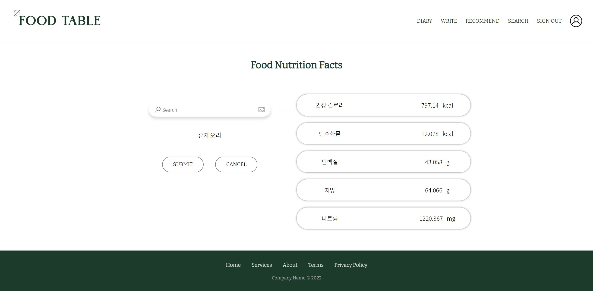

# FoodTable.
2022_멈춰!_졸업작품   
사용자 맞춤 식단추천 서비스


## 개발 환경
- window
- pytorch 1.10.0
- CUDA 11.6
- cudatoolkit 11.3
- sqlite3
- flask
- python 3.9


## 파일 구성
```
AI-healty
├─ templates
│     └─ index.html
├─ static
│   ├─ js
│   │   └─ .js
│	├─ images
│   │   └─ .jpg .png
│   └─ css
│       └─ .css
├─ app.py # 실행 파일
├─ db_models.py # 데이터베이스 처리(SQLAlchemy)
└─ test3.db
```

## 일정
- 2022.05 ~ 프로젝트 시작
- 2022.07.09 최종 완료
- 2022.07.13 최종 보고서 작성
- 2022.07.15 최종 보고서 제출
- 2022.07.22 최종 발표

## UI





